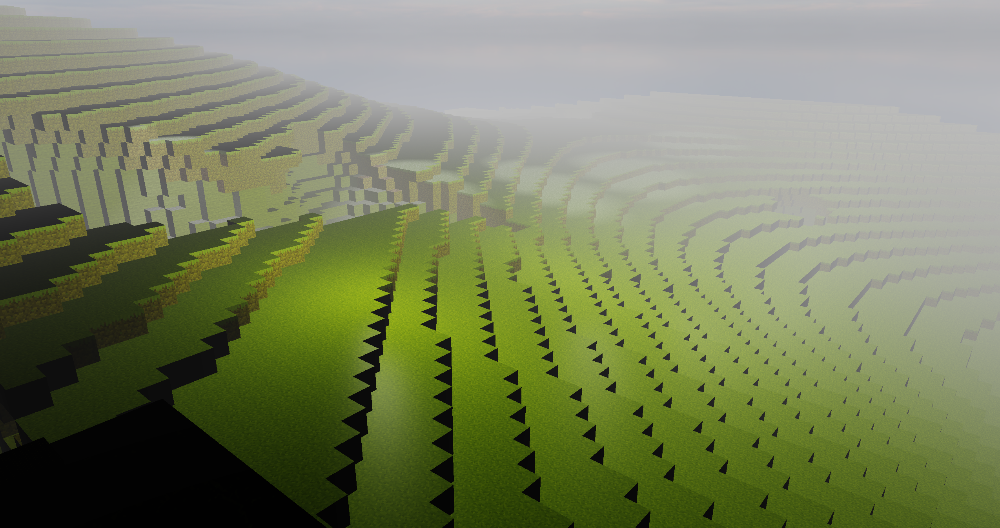

# OPENGL Voxel Game
Please use Visual Studio 2022

Voxel engine with simple perlin noise terrain. The window can be re-sized.

## Lights
There is one directional light, multiple point lights, multiple spot lights and a flashlight (another spotlight).
The light types can be toggled on and off with these keybinds.

| Keybind | Light Type |
| ------------- | ------------- |
| E  | Flashlight |
| R  | Directional Light |
| T  | Point Lights |
| Y  | Spot Lights |

The spot lights and point lights are behind you when you spawn in, over the terrain.

## Objects
I have 3 types of objects, the first is chunks, these are procedural and I store the vertex data in a single packed unsigned int.
The next type is standard objects, these are the default cube and floor model, they have 11 floats for vertex data and the VBO and EBO remain static.
The final type is the cube map, the vertices are only made up of a position.

## Shaders
I have added diffuse, specular and normal maps.
The normal maps have the TBN matrix applied, and can be toggled with the following keybind.

| Keybind | Texture map |
| ------------- | ------------- |
| Q  | Normal Map |

I also calculate the normal matrix for transforming objects without a normal map.

I have added a simple fog effect, I'd also like to add shadow mapping in the future.

### Preprocessor
I have written a custom preprocesser inside the shader class, this is able to read custom syntax before a shader is compiled.
It searches for:
*#include "path"*
And it will copy code in from other shader files inside an include folder.
This allows me to use the same code for multiple shaders.

## World Generation
I currently use a simple perlin noise function that doesn't repeat for my terrain, this means that you can find the border of the perlin noise fairly quick if you go far from spawn.

### Threading
The chunk loading is offloaded onto another thread, on the main thread I calculate all the chunks that are no longer within distance, and then I sort the new chunks to be created based on distance from the player.

I then load the closest chunk to the player on another thread, and when it finishes it waits for the main thread to process the data before calculating the next chunk.

This means you can fly as fast as you want with as big a render distance as you want and the chunks directly under you stay loaded.

## TODO
### World Generation Class
Have a separate class dedicated to generating block data based on position.

### Shadows
Add shadow mapping for all light types. Requires framebuffers.

### Block breaking and placing
Use DDA (Digital Differential Analyzer) algorithm and get block and face player is looking at.

### Save data to disk
Store the data in a compressed format on disk by saving each sub chunk with a palette containing the blocks in that sub chunk, and then only store as many bits as log2(number of blocks in palette) per block.

### Fix Chunk Loading Bug
Very rarely a chunk will not update its block data when loading, I think I'm reading/writing data somewhere on two threads without locking with a mutex.